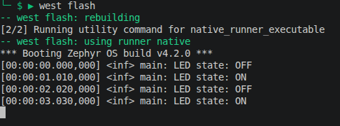

# Zephyr Training Environment

Welcome to the Zephyr RTOS training! This repository uses Zephyr 4.2.0 and
Zephyr SDK 0.17.4. It includes a west manifest for fetching the required
Zephyr dependencies.

## Manifest Setup

Create a virtual environment.
Install west and initialize or update the workspace from the workspace root:

```sh
pip install west
west update
```

The manifest pins Zephyr to `v4.2.0` and places it, together with the selected
modules, under `deps/`.

## Zephyr SDK

Download and extract [Zephyr SDK 0.17.4](https://github.com/zephyrproject-rtos/sdk-ng/releases/tag/v0.17.4), then run:

```sh
cd zephyr-sdk-0.17.4
./setup.sh
```

Build the application with the native simulator:

```sh
west build -p always -b native_sim zephyr-course/app
```

then flash the application

```sh
west flash
```

After that, the following boot head should be shown:



---

## Further resources

- [Getting Started Guide - Zephyr 4.2.0 documentation](https://docs.zephyrproject.org/4.2.0/develop/getting_started/index.html)
